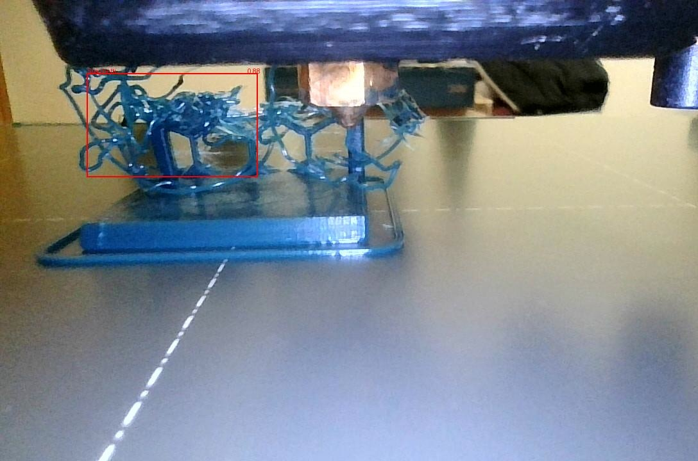
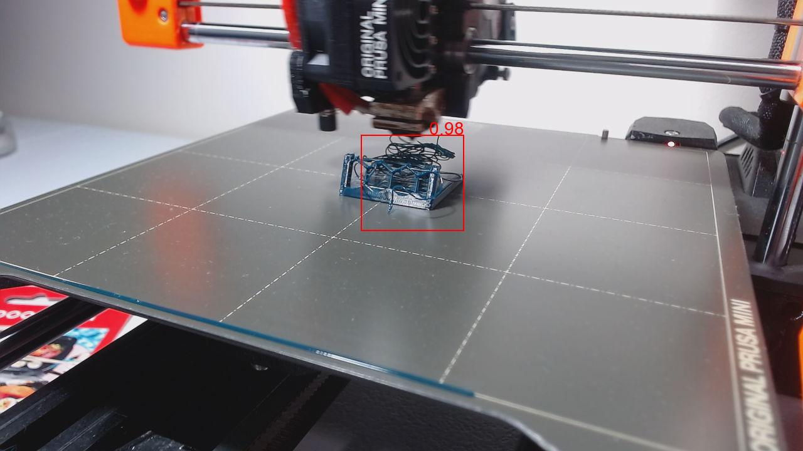
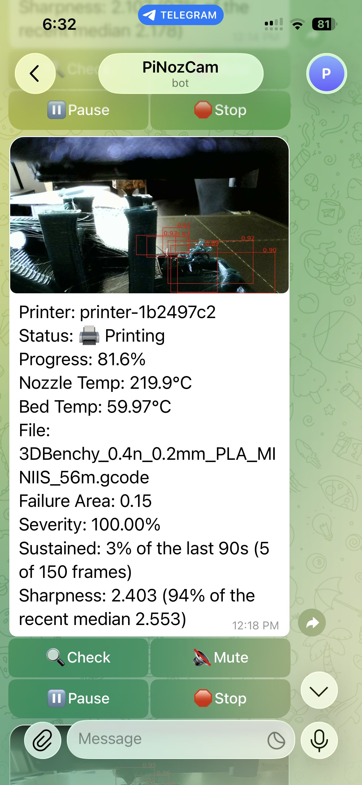
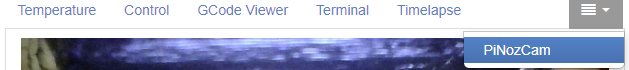
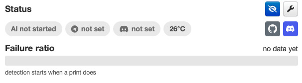

# OctoPrint-PiNozCam

<p align="center"><strong>🔎 Detect failures. 📱 Check your printer. ⏸️ Pause or stop from your phone.</strong></p>
<p align="center">AI failure detection + phone monitoring &amp; control for OctoPrint —<br>
all yours on a <strong>~US$45 Raspberry Pi 5 (1 GB)</strong>. Detection runs on your printer, and there is no subscription.</p>

<div align="center">
  
  
</div>

<p align="center">
  <a href="https://github.com/DrAlexLiu/OctoPrint-PiNozCam/releases"></a>
  <a href="LICENSE"></a>
  <a href="#-supported-platforms"></a>
  <a href="https://discord.gg/gv4tKJ2ZKr"></a>
</p>

PiNozCam watches your OctoPrint camera, spots failures, and alerts you —
or pauses or stops the print for you. Detection runs on your own machine,
and no frame is uploaded for the model to look at. See
[Private by default](#-private-by-default) for what the optional Telegram
and Discord integrations do send.

| 🔎 **AI Failure Detection** | 📱 **Remote Printer Monitor & Control** |
|---|---|
| Watches your camera frames locally | Press **Check** in Telegram or Discord |
| Shows every detection with boxes | See the camera and printer status anytime |
| You decide how sensitive it is | Mute alerts, Pause or Resume the print |
| Alert, Pause, or Stop — your call | Stop the print with one confirmation tap |

## 📱 Your printer, in your pocket

Connect Telegram or Discord: AI failure alerts land on your phone, and you
can see the camera, pause, or stop the print right from the chat. Don't
wait for an alert — press **Check** whenever you're curious.

| Telegram | Discord |
|---|---|
|  |  |

- 🔍 **Check** — current camera view + printer status
- 🔇 **Mute / Unmute** — quiet alerts for this print
- ⏸️ **Pause / Resume** — step in from anywhere
- ⏹️ **Stop** — cancel with a confirmation tap
- 🚨 **Failure alert** — the analysed image, boxes included
- 🖨️ **Multiple printers** — one chat, all your printers

Setup guide: [docs/notifications.md](docs/notifications.md)

## ✨ Why PiNozCam

- **The AI runs on your machine** — no account, no telemetry, no fee, and
  no frame is uploaded for the model to look at. ⚠️ Telegram and Discord
  are the exception, and it is more than just alerts: Check, `/hi`,
  connection tests and the welcome message all send a camera image
  through those services too, once you turn either one on. See
  [Private by default](#-private-by-default).
- **Cheap hardware is enough** — a ~US$45 Raspberry Pi 5 with 1 GB RAM
  runs it comfortably.
- **CPU, NPU, and GPU support** — Raspberry Pi, x86, selected Rockchip and
  Allwinner NPUs, and Jetson Orin.
- **Works with your existing camera** — whatever OctoPrint already uses.
- **Undetect Zones** — mask bed clips, cables, and logos that confuse the AI.
- **Gentle on your printer** — cap CPU use and check rate so printing
  always comes first.

> [!IMPORTANT]
> PiNozCam is a monitoring aid, not a safety system. Start with
> **Alert only**, watch a few prints, then decide whether to allow automatic
> Pause or Stop. Never leave a printer unattended just because monitoring
> is on.

## 🧩 Supported platforms

Any Linux machine with Python 3.7+ — every Raspberry Pi from the Zero 2 W / Pi CM0
up, any ARM64 or x86_64 PC, and NPU boards like the **Orange Pi 3B**,
**BIQU CB2**, Radxa ROCK 4D, LubanCat-4, Radxa A733, WalnutPi (T527) and the
**D-Robotics RDK X5**, plus Jetson Orin and x86-64 Vulkan GPUs, and
**Apple Silicon Macs** (macOS 14+). PiNozCam finds the fastest option your
board has on its own, and falls back to the CPU when there is nothing faster.

<details>
<summary>Platform details -- Apple Silicon, NPU setup checklists, 32-bit vs 64-bit</summary>

NVIDIA and AMD have been hardware-qualified for the Vulkan GPU path; Intel
uses the same vendor-neutral runner but remains provisional until it has
completed the hardware qualification matrix.

**Apple Silicon Macs** are built and hardware-qualified like the others, and
are most useful for trying PiNozCam out or running it beside a printer you
already have a Mac next to. They use the **Apple Neural Engine** through
CoreML -- measured at 5.14 ms per check on an A18 Pro, 10x that machine's
own CPU and faster than any board above -- and fall back to the CPU model
bundled in the same package if CoreML cannot load. The Apple GPU is
deliberately not used: measured on the same machine and graph it is
marginally *slower* than the CPU, while the Neural Engine is 6x faster.
*(No Windows, Intel Macs, FreeBSD, or Android/Octo4a.)*

Rockchip users can verify the driver, runtime library and OctoPrint service
permissions with the [Rockchip NPU setup checklist](docs/rockchip-npu.md),
and Allwinner A733 or T527 users with the
[Allwinner NPU setup checklist](docs/allwinner-npu.md).

If an ARM board supports both operating systems, prefer **64-bit AArch64**:
it is usually faster and is the recommended installation. The 32-bit ARMHF
runtime remains supported for boards and OctoPi images that require it.

</details>

### ⚡ How fast is it?

| Device | Checks/min |
|---|---:|
| Raspberry Pi 5 | 221 |
| Raspberry Pi 4 / CM4 | 23 |
| Jetson Orin Nano Super | 335&dagger; |
| BIQU CB2 / Orange Pi 3B (RK3566 NPU) | 215 |
| LubanCat-4 (RK3588 NPU) | 625 |

These are full camera-to-result checks, the rate you actually get, except
&dagger;: the Jetson figure is the detection step alone -- it has not been
measured end to end yet. More boards (Radxa A733, WalnutPi, Raspberry Pi
3B+), the detection-only figures for every board -- up to 1,143/min on the
RK3588 -- and the full breakdown are in
[docs/performance.md](docs/performance.md).

Even a few checks per minute is plenty to catch a failing print.

**⚡ If your numbers come out far below the table, suspect the power supply
before the board.** Detection is one of the heaviest things a printer host
ever runs, so it draws current that lighter workloads never do. A supply
that looks fine — the desktop is responsive, nothing has crashed — can still
sag under it, and a Raspberry Pi responds by quietly running the CPU at a
fraction of its rated clock. Nothing errors; the checks just get slower.

Speed Test reports this when it sees it. Two things are worth knowing about
when it will:

- **At the default CPU setting it usually will not fire.** That setting
  deliberately leaves cores for gcode streaming, so it draws less and often
  stays within what a marginal supply can deliver.
- **At 100% it is much more likely.** Measured on a Raspberry Pi 3B+ with a
  marginal supply: the default setting drew no under-voltage at all and
  reported 5.9 s per check, while 100% under-volted for most of the run and
  reported **7.1 s — slower with twice the cores.** That inversion is the
  signature. More cores made it slower because the whole chip was throttled.

**So run Speed Test once at 100% as a power check**, even if you intend to
leave the setting lower. If it reports under-voltage, a better supply and
cable will raise every number on this page; if it does not, your figures are
honest and you can set the level you actually want.

⚠️ Only Raspberry Pi boards report this. On other hardware Speed Test says
nothing about power — not because the supply is fine, but because the board
does not expose the measurement.

**And it's light on memory:** OctoPrint + PiNozCam together stay under
**512 MB** — even a 512 MB Pi Zero 2 W / Pi CM0 works. A **1 GB Raspberry Pi 5
(~US$45)** runs it comfortably. Full tables, 32-bit vs 64-bit numbers, and
memory figures: [docs/performance.md](docs/performance.md). On a 512 MB Zero
2 W / Pi CM0, an administrator should follow that guide's manual zram setup
before production use so memory pressure uses compressed RAM before slow
SD-card swap. PiNozCam cannot make system-level swap changes itself.

## 📦 Install

Install **PiNozCam** from **Settings → Plugin Manager → Get More**, or by
URL:

```text
https://github.com/DrAlexLiu/OctoPrint-PiNozCam/archive/refs/tags/1.1.0.zip
```

The installer picks the right build for your machine automatically and asks
pip for its exact runtime version from PyPI. Restart OctoPrint, then follow the
first-run wizard.

## 🚀 First run — three decisions

1. **Camera** — PiNozCam checks the webcam OctoPrint already uses.
2. **Sensitivity** — pick a preset; you can refine it later.
3. **Action on Failure** — start with **Alert only**.

Tune it like this: stay on **Alert only**, start sensitive, and step down
until false alerts stop bothering you. Full logic and preset tables:
[docs/detection-and-tuning.md](docs/detection-and-tuning.md)

## 📷 Camera tips

A rigid mount, even lighting, and a clean lens matter more than resolution.
Point a nozzle camera 5–10 cm from the nozzle, or use an overview camera
that keeps the whole part visible. MJPEG streams, HTTP snapshots, and local test
images all work.

Placement photos and the full checklist: [docs/camera.md](docs/camera.md)

## 🔒 Private by default

Detection runs on your OctoPrint machine and uploads no frame to do it.
Nothing leaves your network unless **you** connect Telegram or Discord —
and once you do, more than alerts go through them. Each of these sends a
camera image and message text to that service; failure alerts and Check
also include printer/status information:

- a **failure alert**, with the detection boxes drawn on the frame, and
  printer state and progress;
- **Check** in either bot, or **/hi** in Telegram — the CURRENT camera
  view, unmasked, not the analysed frame an alert carries, with the same
  printer/status information;
- the **connection test**, so you can confirm messages reach you without
  waiting for a real failure — a masked camera frame and a fixed test
  message, no live printer status;
- the one-time **welcome message** after setup — a masked camera frame
  and fixed setup instructions, likewise no live status.

Keep bot tokens secret like passwords.

## 🖥️ OctoPrint interface

PiNozCam adds its own OctoPrint status tab and keeps all detector controls
together under **Settings → PiNozCam**.

<p align="center">
  
</p>

<p align="center">
  
</p>

## 📖 License

Open source under [AGPL-3.0](LICENSE). Third-party notices:
[THIRD_PARTY_LICENSES/](THIRD_PARTY_LICENSES/).

## 🤝 Support

- 💬 Questions: [PiNozCam Discord](https://discord.gg/gv4tKJ2ZKr)
- 🐛 Bugs: [GitHub Issues](https://github.com/DrAlexLiu/OctoPrint-PiNozCam/issues)

## 🛠️ Troubleshooting with an LLM

When asking an LLM for help, include this public repository URL so it can
check the actual source and documentation:

```text
https://github.com/DrAlexLiu/OctoPrint-PiNozCam
```

Also include the exact PiNozCam version, board and OS, selected backend, and
the relevant error lines. Remove API keys, bot tokens, passwords, camera URL
credentials, and other secrets before sharing any configuration or log.
