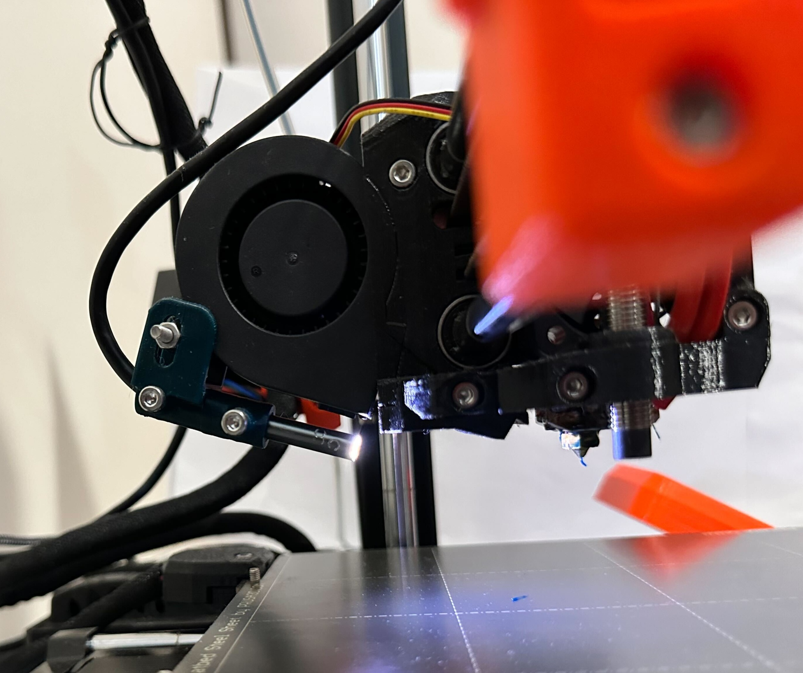
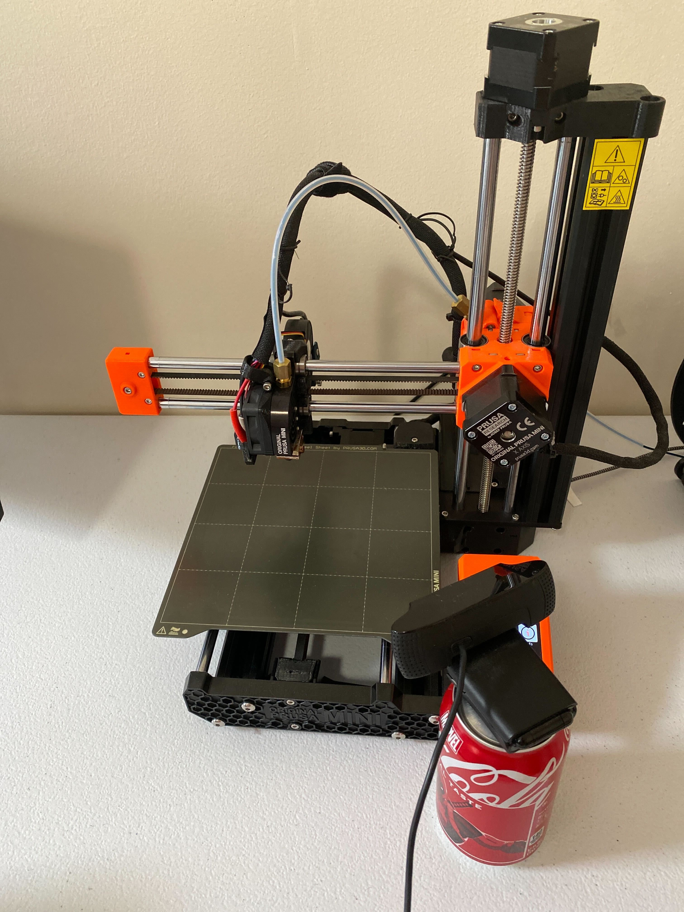

# Camera setup guide

[← Back to README](../README.md)

PiNozCam uses the webcam already configured in OctoPrint. This guide covers
choosing a camera position, checking the image, supported source types, and
how the live view works.

## Choose a view

| Nozzle camera | Overview camera |
|---|---|
| Mount close to the nozzle so small extrusion problems fill more of the frame. | Mount where the current layer and the printed part remain visible throughout the job. On an enclosed printer this is the position usually called a chamber camera. |
|  |  |

## Installation checklist

1. Fix the camera rigidly. Vibration and autofocus hunting reduce usable
   sharpness more than extra resolution helps.
2. Aim a nozzle camera roughly 5–10 cm from the nozzle, or place an overview
   camera far enough away to keep the complete print area visible.
3. Use even lighting. Avoid a bright lamp reflected directly into the lens.
4. Prefer at least 480p and a stable frame rate. A 16:9 view best matches the
   current calibration set, but 4:3 and portrait inputs are letterboxed rather
   than stretched.
5. Focus on the extrusion/print surface, not the background. Disable autofocus
   if it repeatedly refocuses while the toolhead moves.
6. Clean the lens and check that cables, bed clips, and the toolhead do not
   cover the important area.
7. Configure the camera in OctoPrint, then open PiNozCam's Camera tab and press
   **Test**. If using a different IP camera, enter its snapshot or MJPEG URL.
8. Start with **Alert only**. Draw Undetect Zones over fixed objects that
   produce boxes.

## Supported camera sources

Leave **Custom camera URL** empty to use OctoPrint's selected snapshot webcam.
PiNozCam supports both the current OctoPrint webcam-provider stack and the
legacy global webcam configuration.

A custom source may be:

```text
http://camera/webcam/?action=stream     # MJPEG stream
http://camera/webcam/?action=snapshot   # JPEG snapshot
file:///home/pi/test.jpg                # local test image
```

- **MJPEG stream:** best for a continuously running OctoPrint or IP camera.
- **HTTP snapshot:** works with cameras that provide one JPEG per request.
- **Local file:** useful for installation checks and repeatable testing.

PiNozCam follows OctoPrint's flip and rotation settings, keeps the image's
aspect ratio, and correctly maps detection boxes back onto the displayed
camera image.

RTSP is not supported as a direct AI source. HLS and WebRTC URLs are not
parsed by the MJPEG reader.

## Live view

The default **AI Result** view shows the exact frame analysed by the model and
draws the returned boxes in the browser using a canvas. Drawing those boxes
uses the computer or phone viewing OctoPrint, not the printer's CPU.

When OctoPrint exposes a browser-compatible stream, **Live Camera** connects
the browser directly to it for fluid video. Boxes are intentionally not drawn
over that stream: a live frame is not the same frame that produced the AI
result. Polling and the live stream pause when the PiNozCam tab is hidden.
